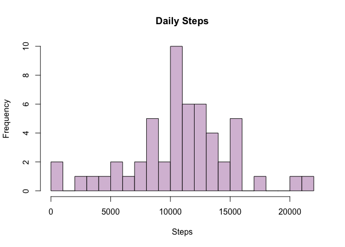
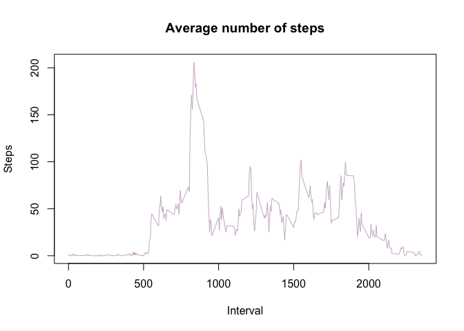
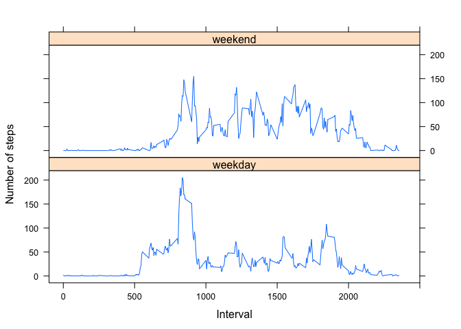

Reproducible Research Peer Assessment 1
---------------------------------------

# Introduction

It is now possible to collect a large amount of data about personal movement using activity monitoring devices such as a [Fitbit](http://www.fitbit.com/), [Nike Fuelband](http://www.nike.com/us/en_us/c/nikeplus-fuelband), or [Jawbone Up](https://jawbone.com/up). These type of devices are part of the “quantified self” movement – a group of enthusiasts who take measurements about themselves regularly to improve their health, to find patterns in their behavior, or because they are tech geeks. But these data remain under-utilized both because the raw data are hard to obtain and there is a lack of statistical methods and software for processing and interpreting the data.

This assignment makes use of data from a personal activity monitoring device. This device collects data at 5 minute intervals through out the day. The data consists of two months of data from an anonymous individual collected during the months of October and November, 2012 and include the number of steps taken in 5 minute intervals each day.

The data for this assignment can be downloaded from the course web site:

Dataset: [Activity monitoring data](https://d396qusza40orc.cloudfront.net/repdata%2Fdata%2Factivity.zip) [52K]

The variables included in this dataset are:

**steps**: Number of steps taking in a 5-minute interval (missing values are coded as **NA**)
**date**: The date on which the measurement was taken in YYYY-MM-DD format
**interval**: Identifier for the 5-minute interval in which measurement was taken

The dataset is stored in a comma-separated-value (CSV) file and there are a total of 17,568 observations in this dataset.

## 1. Loading and preprocessing the data

### 1.1. loading data. 

let's unzip the file to get it as a csv file.


```r
unzip(zipfile = "activity.zip", exdir = getwd())
```

### 1.2. Reading the data with **read.csv()**


```r
AMD <- read.csv("activity.csv")
str(AMD)
```

```
## 'data.frame':	17568 obs. of  3 variables:
##  $ steps   : int  NA NA NA NA NA NA NA NA NA NA ...
##  $ date    : chr  "2012-10-01" "2012-10-01" "2012-10-01" "2012-10-01" ...
##  $ interval: int  0 5 10 15 20 25 30 35 40 45 ...
```

## 2. What is mean total number of steps taken per day?

### 2.1. Calculate the total number of steps taken per day

First, let's convert the date variable into a date class variable 

```r
AMD$date <- as.Date(AMD$date, "%Y-%m-%d")
```
Then, subset the sum of steps by date

```r
stepsperday <- aggregate(steps ~ date, AMD, sum)
head(stepsperday)
```

```
##         date steps
## 1 2012-10-02   126
## 2 2012-10-03 11352
## 3 2012-10-04 12116
## 4 2012-10-05 13294
## 5 2012-10-06 15420
## 6 2012-10-07 11015
```

### 2.2. Make a histogram of the total number of steps taken each day

```r
hist(stepsperday$steps, breaks = 30, col = "thistle", xlab = "Steps", main = "Daily Steps")
```

<!-- -->

### 2.3. Calculate and report the mean and median of the total number of steps taken per day

```r
meantotstep <- mean(stepsperday$steps, na.rm = TRUE)
mediantotstep <- median(stepsperday$steps, na.rm = TRUE)
dmeantotstep <- as.numeric(format(round(meantotstep, digits = 4)))
```

The mean of the total number of steps taken per day is 1.076619\times 10^{4} and the median is 10765

## 3. What is the average daily activity pattern?

### 3.1. Make a time series plot (i.e. type = "l") of the 5-minute interval (x-axis) and the average number of steps taken, averaged across all days (y-axis)

```r
meanstep <- aggregate(steps ~ interval, AMD, mean, na.rm = TRUE)
with(meanstep, plot(interval, steps, type = "l", col = "thistle3", main = "Average number of steps", ylab = "Steps", xlab = "Interval"))
```

<!-- -->

### 3.2. Which 5-minute interval, on average across all the days in the dataset, contains the maximum number of steps?

```r
maxstep <- meanstep[which.max(meanstep$steps),1]
```
The interval with most steps is 835

## 4. Imputing missing values

### 4.1. Calculate and report the total number of missing values in the dataset (i.e. the total number of rows with NAs)

```r
summary(AMD)
```

```
##      steps             date               interval     
##  Min.   :  0.00   Min.   :2012-10-01   Min.   :   0.0  
##  1st Qu.:  0.00   1st Qu.:2012-10-16   1st Qu.: 588.8  
##  Median :  0.00   Median :2012-10-31   Median :1177.5  
##  Mean   : 37.38   Mean   :2012-10-31   Mean   :1177.5  
##  3rd Qu.: 12.00   3rd Qu.:2012-11-15   3rd Qu.:1766.2  
##  Max.   :806.00   Max.   :2012-11-30   Max.   :2355.0  
##  NA's   :2304
```

```r
NAtotvalues <- sum(is.na(AMD))
NAtotvalues
```

```
## [1] 2304
```
There are 2304 NA values in the data set, all of them are in the steps variable.

### 4.2. Devise a strategy for filling in all of the missing values in the dataset. The strategy does not need to be sophisticated. For example, you could use the mean/median for that day, or the mean for that 5-minute interval, etc.

```r
medianstep <- aggregate(steps ~ interval, AMD, median)
NAstep <- numeric()
for (i in 1:nrow(AMD)) {
        NAAMD <- AMD[i, ]
        if (is.na(NAAMD$steps)) {
                steps <- subset(medianstep, interval == NAAMD$interval)$steps
        } else {
                steps <- NAAMD$steps
        }
        NAstep <- c(NAstep, steps)
}
```

### 4.3 Create a new dataset that is equal to the original dataset but with the missing data filled in.

```r
AMDnew <- AMD
AMDnew$steps <- NAstep
head(AMDnew)
```

```
##   steps       date interval
## 1     0 2012-10-01        0
## 2     0 2012-10-01        5
## 3     0 2012-10-01       10
## 4     0 2012-10-01       15
## 5     0 2012-10-01       20
## 6     0 2012-10-01       25
```

### 4.4 Make a histogram of the total number of steps taken each day and Calculate and report the mean and median total number of steps taken per day. 

```r
totalsteps <- aggregate(steps ~ date, AMDnew, sum)
hist(totalsteps$steps, breaks = 30, col = "thistle", xlab = "Steps", main = "Daily Steps")
```

<!-- -->

```r
totalstepsmean <- mean(totalsteps$steps)
totalstepsmedian <- median(totalsteps$steps)

dtotalstepsmean <- as.numeric(format(round(totalstepsmean, digits = 4)))
dtotalstepsmedian <- as.numeric(format(round(totalstepsmedian, digits = 4)))

difmean <- dmeantotstep - dtotalstepsmean
difmedian <- mediantotstep - dtotalstepsmedian
```

### Do these values differ from the estimates from the first part of the assignment?

| Type of Estimate                        |       Mean         |        Median        |
|-----------------------------------------|--------------------|----------------------|
| First Part (with Na)                    | 1.076619\times 10^{4}   | 10765    |
| Second Part (with median instead of NA) | 9503.869| 1.0395\times 10^{4}|
| **Difference**                          | 1262.321        | 370        |


### What is the impact of imputing missing data on the estimates of the total daily number of steps?

The impact of the NA values is reflected on the variance between mean and median of the total steps per day with and without NA values.


## 5. Are there differences in activity patterns between weekdays and weekends?

### 5.1. Create a new factor variable in the dataset with two levels – “weekday” and “weekend” indicating whether a given date is a weekday or weekend day.

```r
weekdays <- c("Monday", "Tuesday", "Wednesday", "Thursday", "Friday")
AMDnew$day <- weekdays(AMDnew$date)
library(dplyr)
```

```
## 
## Attaching package: 'dplyr'
```

```
## The following objects are masked from 'package:stats':
## 
##     filter, lag
```

```
## The following objects are masked from 'package:base':
## 
##     intersect, setdiff, setequal, union
```

```r
AMDnew <- mutate(AMDnew, dayFactor = as.factor(if_else(is.element(AMDnew$day , weekdays), "weekday", "weekend")))
head(AMDnew)
```

```
##   steps       date interval    day dayFactor
## 1     0 2012-10-01        0 Monday   weekday
## 2     0 2012-10-01        5 Monday   weekday
## 3     0 2012-10-01       10 Monday   weekday
## 4     0 2012-10-01       15 Monday   weekday
## 5     0 2012-10-01       20 Monday   weekday
## 6     0 2012-10-01       25 Monday   weekday
```

### 5.2. Make a panel plot containing a time series plot (type = "l") of the 5-minute interval (x-axis) and the average number of steps taken, averaged across all weekday days or weekend days (y-axis).

```r
totalsteps <- aggregate(steps ~ interval + dayFactor, AMDnew, mean)
library(lattice)
xyplot(steps ~ interval | dayFactor, data = totalsteps, type = "l", layout = c(1,2), ylab = "Number of steps", xlab= "Interval", xlim = c(-100,2500))
```

<!-- -->

The number of total steps during the weekdays are lower than during the weekends. 
There's low activity during the 0 and 500 intervals of time, for both cases.
The range of total steps on weekends doesn't exceed 150 total steps per day.
On weekdays, there's a peak during 800 and 1000 intervals of time, where the total steps per day comes to 200, the rest of intervals reach maximum to 100 steps per day.
